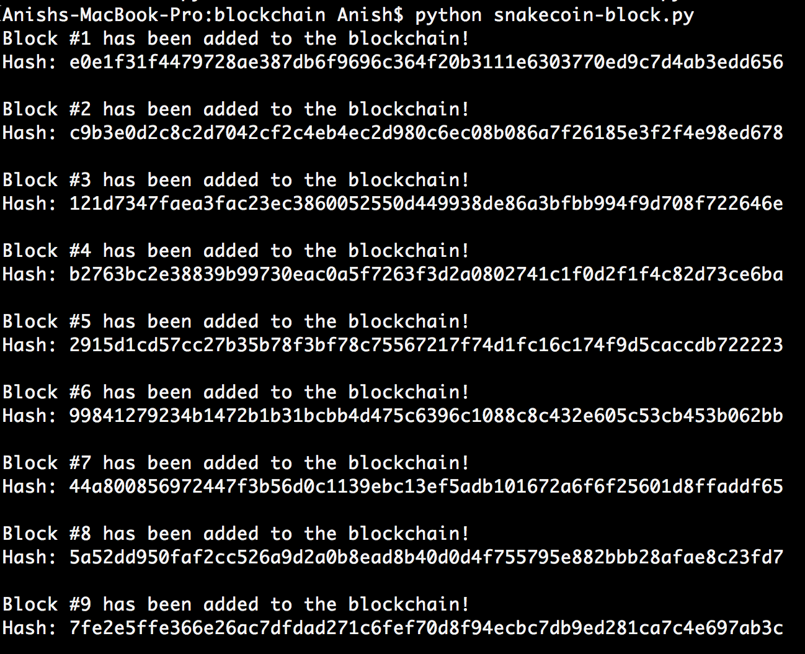
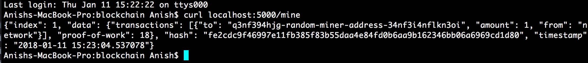

# Blockchain Work for COSC 98

Note: several of these files are from previous hacking tutorials, so that I could integrate and utilize some of the blockchain work that I had done previous, for convenience

Please run the following commands to run the blockchain and smart contract applications smoothly.
1. brew update
2. brew upgrade
3. brew tap ethereum/ethereum
4. brew install ethereum
5. npm install -g solc
6. solcjs -o target --bin --abi Greeter.sol
7. geth

Much of this blockchain follows from tutorials outlining how to build apps on the Ethereum network:
https://www.ethereum.org/greeter

I followed several tutorials in order to garner a better understanding of the blockchain.

In the first tutorial, I built a Hello World voting application locally on a test Ethereum network, with full decentralized functionality

https://medium.com/@mvmurthy/full-stack-hello-world-voting-ethereum-dapp-tutorial-part-1-40d2d0d807c2

In the second tutorial, I utilized Remix IDE in order to build a smart contract using Ethereum; unfortunately I was unable to get the full front end running locally even though my smart contract was fully functional in the online IDE

https://medium.com/@merunasgrincalaitis/the-ultimate-end-to-end-tutorial-to-create-and-deploy-a-fully-descentralized-dapp-in-ethereum-18f0cf6d7e0e

The below is a preview of what the finalized front end looks like

Finally, I built a blockchain using Python to understand the nature of the decentralized ledger that forms the basis for the cryptocurrencies, and their associated craze today!

https://medium.com/crypto-currently/lets-build-the-tiniest-blockchain-e70965a248b

https://medium.com/crypto-currently/lets-make-the-tiniest-blockchain-bigger-ac360a328f4d

Example of blockchain being built

Example of block being mined and transaction record with server running

Apologies for the piecemeal approach to the Hack-a-thing assignment: rather than simply targeting one tutorial, I wanted to sample several facets of the the blockchain to facilitate a better understanding for when project time comes around.

var _greeting = "Hello World!"

var greeter = greeterFactory.new(_greeting,{from:eth.accounts[0],data:greeterCompiled,gas:47000000}, function(e, contract){
    if(!e) {

      if(!contract.address) {
        console.log("Contract transaction send: TransactionHash: " + contract.transactionHash + " waiting to be mined...");

      } else {
        console.log("Contract mined! Address: " + contract.address);
        console.log(contract);
      }

    }
})
